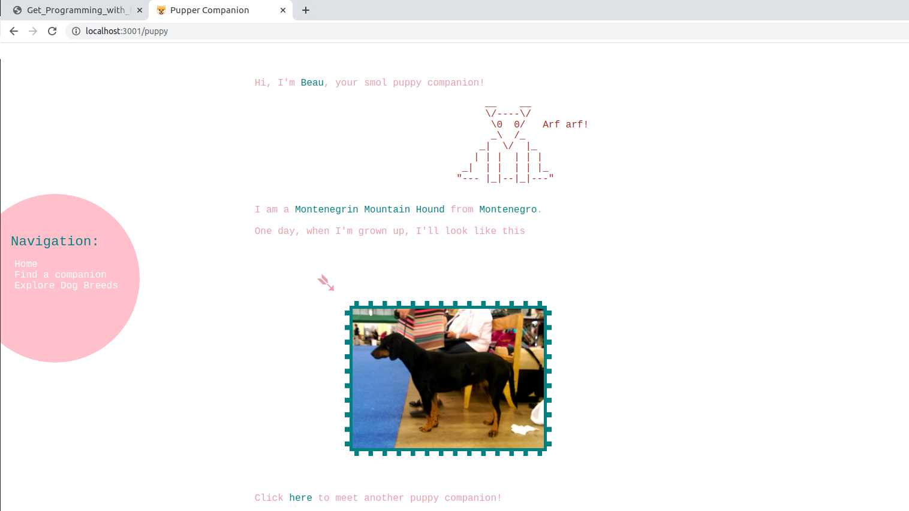
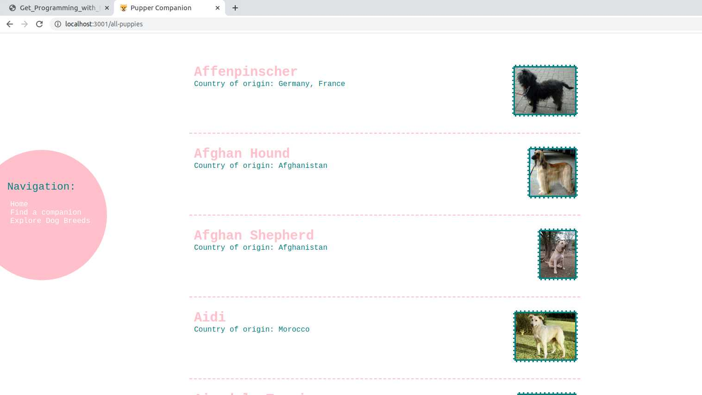

# intro-into-node

This repository serves to document the progress made in learning node.js.

## Version v.01 : Pupper Companion 

A simple application making use of the npm modules [dog-breeds](https://www.npmjs.com/package/dog-breeds) and [dog-names](https://www.npmjs.com/package/dog-names).
The application serves the following three routes:

### `/` : Home
Introduction and Links

### `/puppy` : Find a Companion
Generates a random puppy companion from [dog-breeds](https://www.npmjs.com/package/dog-breeds) and [dog-names](https://www.npmjs.com/package/dog-names)

### `/all-puppies` : Explore dog breeds
Gives an overview of all dog breed data available in [dog-breeds](https://www.npmjs.com/package/dog-breeds).
